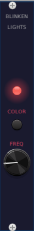
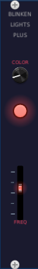

# duddex's VCV Rack Modules

A collection of modules for [VCV Rack](https://vcvrack.com/) by duddex.

**Note:** These modules were created as an experiment in how GitHub Copilot and LLMs can assist in software development. The entire workflow — from setting up the build environment (downloading and configuring MSYS2/MinGW and the Rack SDK), to writing module code, designing panel layouts, and authoring this very README — was done with significant LLM support using GitHub Copilot with Claude Opus 4.6.

## Table of Contents

- [Modules](#modules)
  - [Tropical Oscillator](#tropical-oscillator)
  - [Blinkenlights](#blinkenlights)
  - [Blinkenlights Plus](#blinkenlights-plus)

## Modules

### Tropical Oscillator

A polyphonic oscillator based on **Tropical Additive Synthesis**, combining five cosine oscillators using the **minimum** operator (tropical addition in min-plus algebra) instead of summation. This produces complex, angular waveforms rich in harmonics, with controls for per-oscillator frequency multipliers, detuning, and amplitude offsets (tropical VCAs), plus polyphonic V/OCT input and a DC offset knob.

For full documentation, see [TropicalOscillator.md](TropicalOscillator.md).

### Blinkenlights

A simple utility module with a blinking LED. A knob controls the blink frequency from 0.1 Hz to 5 Hz (default 1 Hz), and a button cycles the LED color through red, yellow, and green. Useful for visual tempo reference or just for fun.

| Control | Type | Range | Default | Description |
|---------|------|-------|---------|-------------|
| **FREQ** | Knob | 0.1 – 5 Hz | 1 Hz | Blink frequency |
| **COLOR** | Button | — | Red | Cycles LED color: red → yellow → green |

### Blinkenlights Plus

An extended visual utility module that demonstrates illuminated Rack UI components. It blinks a **light bezel** and a **light slider** in sync. The slider controls blink frequency, and a color knob sweeps through a continuous RGB palette.

| Control | Type | Range | Default | Description |
|---------|------|-------|---------|-------------|
| **COLOR** | Knob | 0 – 255 | 36.5 | Continuous RGB color control (left = black, right = white). Default maps to red. |
| **BEZEL** | Light Bezel | — | — | Illuminated bezel element, blinking with the selected color. |
| **FREQ** | Light Slider | 0.1 – 5 Hz | 2.55 Hz | Blink frequency control for both illuminated elements. |

Color transitions follow this path:

black → red → yellow → green → cyan → blue → magenta → white
