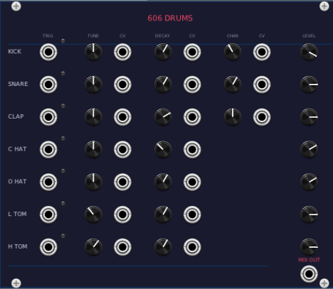
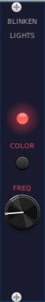
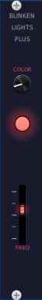

# duddex's VCV Rack Modules

A collection of modules for [VCV Rack](https://vcvrack.com/) by duddex.

**Note:** These modules were created as an experiment in how GitHub Copilot and LLMs can assist in software development. The entire workflow — from setting up the build environment (downloading and configuring MSYS2/MinGW and the Rack SDK), to writing module code, designing panel layouts, and authoring this very README — was done with significant LLM support using GitHub Copilot with Claude Opus 4.8.

## Table of Contents

- [Modules](#modules)
  - [Tropical Oscillator](#tropical-oscillator)
  - [606 Drums](#606-drums)
  - [Blinkenlights](#blinkenlights)
  - [Blinkenlights Plus](#blinkenlights-plus)

## Modules

### Tropical Oscillator

A polyphonic oscillator based on **Tropical Additive Synthesis**, combining five cosine oscillators using the **minimum** operator (tropical addition in min-plus algebra) instead of summation. This produces complex, angular waveforms rich in harmonics, with controls for per-oscillator frequency multipliers, detuning, and amplitude offsets (tropical VCAs), plus polyphonic V/OCT input and a DC offset knob.

For full documentation, see [TropicalOscillator.md](TropicalOscillator.md).

### 606 Drums

A seven-voice analog-style drum module inspired by the classic Roland TR-606. Each voice — **Kick**, **Snare**, **Clap**, **Closed Hat**, **Open Hat**, **Low Tom**, and **High Tom** — has its own trigger input, tuning and decay knobs (plus a character knob on the voices that support it), and a level control. Every knob has an accompanying CV input, so the parameters can be modulated from sequencers, LFOs, or envelopes. All voices are summed to a single mono mix output on the right. Triggering the closed hat chokes the open hat, just like the hardware.



The drum DSP comes from Matthew Fecher's [606 Inspired Synth Drums](https://github.com/analogcode/606-Inspired-Synth-Drums) (MIT licensed), which is included in this repository as a **git submodule** under `lib/606-Inspired-Synth-Drums`. Because of this, after cloning the repository you must initialize the submodule before building:

```sh
git submodule update --init
```

The submodule provides header-only C++14 DSP, so this module is compiled with `-std=c++14` (see the plugin `Makefile`), and its `Source` directory is added to the include path.

| Control | Type | Range | Description |
|---------|------|-------|-------------|
| **TRIG** | Trigger input | — | Fires the voice on a rising edge (per drum) |
| **TUNE** | Knob + CV | -12 – +12 semitones | Pitch of the voice (CV is 1V/oct) |
| **DECAY** | Knob + CV | 0 – 100% | Length of the voice's tail |
| **CHAR** | Knob + CV | 0 – 100% | Character: Kick snap, Snare snappy, Clap noise/air (Kick, Snare, Clap only) |
| **LEVEL** | Knob | 0 – 100% | Voice level into the mix |
| **MIX OUT** | Audio output | — | Summed mono output of all voices |

### Blinkenlights

A simple utility module with a blinking LED. A knob controls the blink frequency from 0.1 Hz to 5 Hz (default 1 Hz), and a button cycles the LED color through red, yellow, and green. Useful for visual tempo reference or just for fun.



| Control | Type | Range | Default | Description |
|---------|------|-------|---------|-------------|
| **FREQ** | Knob | 0.1 – 5 Hz | 1 Hz | Blink frequency |
| **COLOR** | Button | — | Red | Cycles LED color: red → yellow → green |


### Blinkenlights Plus

An extended visual utility module that demonstrates illuminated Rack UI components. It blinks a **light bezel** and a **light slider** in sync. The slider controls blink frequency, and a color knob sweeps through a continuous RGB palette.



| Control | Type | Range | Default | Description |
|---------|------|-------|---------|-------------|
| **COLOR** | Knob | 0 – 255 | 36.5 | Continuous RGB color control (left = black, right = white). Default maps to red. |
| **BEZEL** | Light Bezel | — | — | Illuminated bezel element, blinking with the selected color. |
| **FREQ** | Light Slider | 0.1 – 5 Hz | 2.55 Hz | Blink frequency control for both illuminated elements. |

Color transitions follow this path:

black → red → yellow → green → cyan → blue → magenta → white
