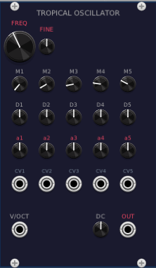

# Tropical Oscillator

Implements **Tropical Additive Synthesis** based on the [paper by Cristiano Bocci and Giorgio Sancristoforo](https://www.giorgiosancristoforo.net/Tropical/paper.pdf). Instead of summing sinusoidal components like classical additive synthesis, this oscillator combines them using the **minimum** operator (tropical addition in min-plus algebra).

$$\text{trop}(x[n]) = \min\lbrace a_1 + \cos(\omega_1 n),\; a_2 + \cos(\omega_2 n),\; \ldots,\; a_5 + \cos(\omega_5 n) \rbrace$$

Five cosine oscillators are individually tuned, offset, and then combined by taking the minimum of all five signals at each sample. This produces complex, angular waveforms rich in harmonics that are fundamentally different from traditional additive synthesis.

For a deeper understanding of Tropical Additive Synthesis, watch this video: [Tropical Additive Synthesis](https://www.youtube.com/watch?v=Va_NSRGceow) on YouTube.

## Pitch

| Control | Label | Range | Default | Description |
|---------|-------|-------|---------|-------------|
| Knob (large) | **FREQ** | 20 – 10,000 Hz | 261.63 Hz (C4) | Master frequency (logarithmic) |
| Knob (small) | **FINE** | ±100 cents | 0 | Fine tuning |

## Multipliers (M1–M5)

Five small knobs that set the frequency multiplier for each oscillator relative to the master frequency.

| Control | Range | Default | Description |
|---------|-------|---------|-------------|
| **M1** | 0.5 – 16 | 1 | Fundamental |
| **M2** | 0.5 – 16 | 2 | 2nd harmonic |
| **M3** | 0.5 – 16 | 3 | 3rd harmonic |
| **M4** | 0.5 – 16 | 4 | 4th harmonic |
| **M5** | 0.5 – 16 | 5 | 5th harmonic |

Values below 1 produce subharmonics. The multiplier is continuous, so non-integer ratios (inharmonic tones) are possible.

## Detuners (D1–D5)

Five small knobs that add a fixed Hz offset to each oscillator's frequency. Detuning creates **tropical beatings** — slow morphing of the waveform shape.

| Control | Range | Default |
|---------|-------|---------|
| **D1–D5** | ±10 Hz | 0 Hz |

## Tropical VCAs (a1–a5)

Five small knobs that set the vertical offset (amplitude shift) for each oscillator. In tropical algebra, multiplication becomes addition, so these offsets act as amplitude controls. Raising an offset pushes that oscillator's cosine upward, making it less likely to "win" the minimum, effectively fading it out.

| Control | Range | Default |
|---------|-------|---------|
| **a1–a5** | ±1 | 0 |

## CV Inputs (CV1–CV5)

Five jack inputs for voltage control of the tropical VCAs. The CV is scaled by 1/10 (i.e., ±10V maps to ±1) and added to the corresponding knob value.

## Bottom Row

| Control | Label | Description |
|---------|-------|-------------|
| Input | **V/OCT** | 1V/octave pitch input (polyphonic) |
| Knob | **DC** | DC offset added to the output (±1, scaled to ±5V) |
| Output | **OUT** | Audio output (±5V, polyphonic) |

The DC offset knob is useful because the tropical minimum waveform is inherently asymmetric. Taking the minimum of multiple cosines biases the result downward — the waveform spends more time near its negative peaks than a centered signal would. The exact DC bias depends on the combination of tropical VCA offsets and multiplier settings, and it shifts dynamically as you change those parameters. The DC knob lets you manually compensate for this, which matters for mixer headroom (centering the signal uses the full ±5V range symmetrically) and modulation behavior (a DC-biased signal fed into ring modulators or waveshapers gives different results compared to a zero-centered signal). It can also be used creatively to shift the signal into unipolar territory (0–10V) for driving CV inputs that expect positive voltages.

## Polyphony

The module is fully polyphonic. The number of output channels matches the number of channels on the V/OCT input.

## Tips

- With all tropical VCAs at 0 and default multipliers (1–5), the output is the minimum of five harmonically related cosines — a complex angular waveform.
- Increase a tropical VCA to push that oscillator out of the minimum, removing its contribution from the timbre.
- Small detune values (< 1 Hz) create slow, evolving timbral changes (tropical beatings).
- Modulate the tropical VCAs with slow LFOs for animated spectral movement.
- Set multipliers to odd integers only (1, 3, 5, 7, 9) for a hollow, clarinet-like quality.
- Use subharmonic multipliers (< 1) combined with the fundamental for bass-heavy tones.

## Giorgio Sancristoforo's Software

If you find Tropical Additive Synthesis intriguing, take a closer look at [Giorgio Sancristoforo's website](https://www.giorgiosancristoforo.net/). Giorgio is an artist, sound designer, and software developer who creates unique standalone synthesizer applications for experimental music.

His latest creation, **Homework**, is an experimental modular workstation built around a four-track cassette recorder with granular, reverb, echo, and saturation effects. It includes two modular synthesizers: **The Eye of Horus**, a west coast-style synth featuring two Tropical Additive Synthesis Oscillators, a Hybrid Putney Filter, and a double sequencer; and **Sonda**, a drone synthesizer inspired by Eliane Radigue with five multi-waveform oscillators and multi-mode filters. The whole system is interconnected through patch points on the recorder panel, creating a self-contained experimental echo-system with warm vintage sound.
